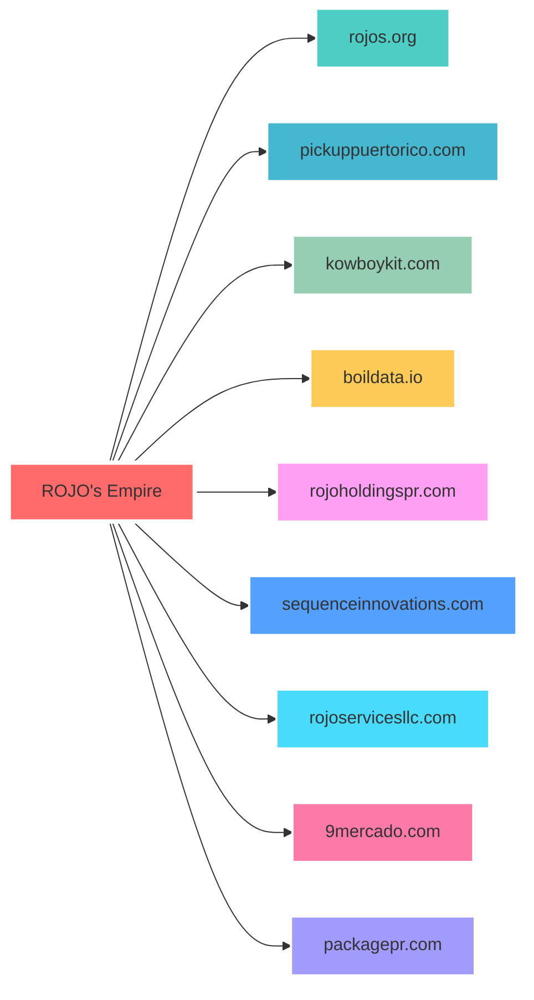

<!-- Animated Wave Header -->


<!-- Animated Typing with Glow Effect -->
<p align="center">
  <a href="https://git.io/typing-svg">
    
  </a>
</p>

<!-- Profile Badges Bar -->
<p align="center">
  
  
  
</p>

<!-- Gradient Divider -->


##  The Lowdown

<div align="center">
<table>
<tr>
<td width="50%" valign="top">

### 🔥 What I'm Cooking

```yaml
Current_Status:
  - 🍝 Serving Hot Pasta Code
  - 💻 GoLang + Python + Duct Tape
  - 🏠 Real Estate Deal Automation
  - 🤖 AI-Driven Bot Madness
  - 📡 IMS Rate Limit Destruction
  - ⚡ "Limits are for quitters"
```

</td>
<td width="50%" valign="top">

### 👨‍👩‍👧‍👦 The Crew

```yaml
Life_Stack:
  - 👰 Married: "3am commit tolerator"
  - 👶 Father: "Teaching console.log early"
  - 🐕 Yorkies: 2x "Code-chewing furballs"
  - 🏝️ Location: "Puerto Rico Paradise"
  - 🎸 Vibe: "We've been truckin' along"
```

</td>
</tr>
</table>
</div>

<!-- Animated Divider -->


## 🌐 My Digital Empire

<div align="center">



</div>

<br/>

<div align="center">
<table>
<thead>
<tr>
<th>🚀 Project</th>
<th>💼 The Deal</th>
<th>📊 Status</th>
</tr>
</thead>
<tbody>
<tr>
<td><a href="http://rojos.org"></a></td>
<td><em>Main HQ. Real estate meets shady AI experiments</em></td>
<td></td>
</tr>
<tr>
<td><a href="http://pickuppuertorico.com"></a></td>
<td><em>Baseball charity—my karma offset</em></td>
<td></td>
</tr>
<tr>
<td><a href="http://kowboykit.com"></a></td>
<td><em>Click tracking that follows you home</em></td>
<td></td>
</tr>
<tr>
<td><a href="http://boildata.io"></a></td>
<td><em>SMS platform—hot as hell, keepin' lines blazing</em></td>
<td></td>
</tr>
<tr>
<td><a href="http://rojoholdingspr.com"></a></td>
<td><em>Real estate hustle in paradise</em></td>
<td></td>
</tr>
<tr>
<td><a href="http://9mercado.com"></a></td>
<td><em>Current Airbnb automation project</em></td>
<td></td>
</tr>
<tr>
<td><a href="http://packagepr.com"></a></td>
<td><em>Ship forwarding SaaS—Puerto Rico shipping solutions</em></td>
<td></td>
</tr>
<tr>
<td><a href="http://sequenceinnovations.com"></a></td>
<td><em>Code & design—bit twisting central</em></td>
<td></td>
</tr>
<tr>
<td><a href="http://rojoservicesllc.com"></a></td>
<td><em>Services & consulting—making deals happen</em></td>
<td></td>
</tr>
</tbody>
</table>
</div>

<!-- Tech Stack Section with Animations -->


## 🛠️ Toolbox & Toys

<div align="center">

### ⚡ Core Languages
<p>
  
</p>

### 🎨 Frontend Arsenal
<p>
  
</p>

### 🔧 Backend & Databases
<p>
  
</p>

### 🚀 DevOps & Tools
<p>
  
</p>

</div>

<!-- Enhanced Stats Section -->


## 📊 GitHub Stats 

<div align="center">
  
<!-- GitHub Stats Cards -->
<p align="center">
  
  
</p>

<!-- Streak Stats -->
<p align="center">
  
</p>

<!-- Activity Graph -->
<p align="center">
  
</p>

</div>

<!-- Personal Metrics Section -->


## 🚀 My Solo Empire Stats

<div align="center">
  
  <!-- Custom Metrics Badges -->
  <p>
    
    
    
  </p>
  
  <p>
    
    
    
  </p>

  <!-- GitHub Profile Summary Cards -->
  <p align="center">
    
    
  </p>

</div>

<!-- Contribution Snake -->
<picture>
  <source media="(prefers-color-scheme: dark)" srcset="https://raw.githubusercontent.com/rojolang/rojolang/output/github-contribution-grid-snake-dark.svg">
  <source media="(prefers-color-scheme: light)" srcset="https://raw.githubusercontent.com/rojolang/rojolang/output/github-contribution-grid-snake.svg">
  
</picture>


## 📬 Let's Connect

<div align="center">
  
[](https://twitter.com/drrojo)
[](https://www.linkedin.com/in/rojo)
[](mailto:rob@split-aces.com)

</div>

<!-- Daily.dev Card -->


## 🎯 Currently Crushing

<div align="center">
  <table>
    <tr>
      <td align="center" width="50%">
        <h3>🔥 This Week I'm On</h3>
        <p>
          <b>🏗️ Building:</b> 3 new Airbnb automations<br/>
          <b>🔧 Breaking:</b> IMS rate limits (again)<br/>
          <b>☕ Fuel:</b> 47 cups and counting<br/>
          <b>🎵 Vibing:</b> Grateful Dead on repeat
        </p>
      </td>
      <td align="center" width="50%">
        <h3>⏱️ How I Spend My Time</h3>
        <p>
          <b>🌙 Night Owl:</b> 11pm - 4am prime time<br/>
          <b>⚡ Languages:</b> Go, Python, TypeScript<br/>
          <b>🔨 Current Stack:</b> Next.js + Supabase<br/>
          <b>📱 Side Quest:</b> Arduino phone hacks
        </p>
      </td>
    </tr>
  </table>
  
  <!-- If you have WakaTime set up, replace YOUR_WAKATIME_USERNAME with your actual username -->
<!-- WakaTime Coding Stats -->
<figure><embed src="https://wakatime.com/share/@rojolang/0ac04d86-c2e8-4519-b309-c8ee4b2816f4.svg"></embed></figure>
</div>

<!-- Footer with Wave -->


<div align="center">
  
  ### 💭 *"Once in a while, you get shown the light in the strangest of places if you look at it right."*
  
  <br/>
  
  
  
  
  
  <br/>
  
  
  
  
</div>

<!-- Hidden Analytics Pixel -->

